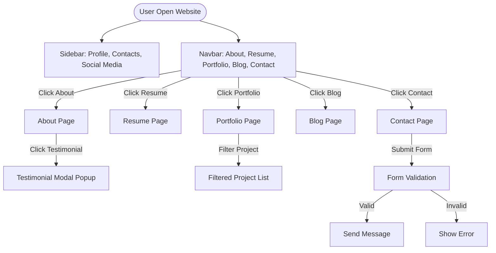

```mermaid
flowchart TD
  Start([User Open Website])
  Start --> Sidebar["Sidebar: Profile, Contacts, Social Media"]
  Start --> Navbar["Navbar: About, Resume, Portfolio, Blog, Contact"]
  Navbar -->|Click About| AboutPage["About Page"]
  Navbar -->|Click Resume| ResumePage["Resume Page"]
  Navbar -->|Click Portfolio| PortfolioPage["Portfolio Page"]
  Navbar -->|Click Blog| BlogPage["Blog Page"]
  Navbar -->|Click Contact| ContactPage["Contact Page"]
  AboutPage -->|Click Testimonial| Modal["Testimonial Modal Popup"]
  PortfolioPage -->|Filter Project| Filtered["Filtered Project List"]
  ContactPage -->|Submit Form| FormValidation["Form Validation"]
  FormValidation -->|Valid| Send["Send Message"]
  FormValidation -->|Invalid| Error["Show Error"]
```